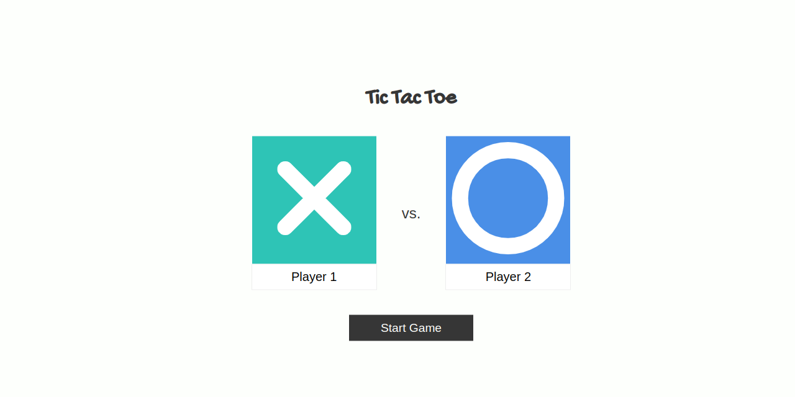

# The Odin Project: Tic Tac Toe
Lesson covering javascript factory functions and module pattern

Live: https://vanessapigwin.github.io/top-tictactoe/

# Output

## Goal / To Do
- [x] Create objects for a gameboard, display controller, players
- [x] Player name entry via form
- [x] Clicks trigger game and update UI and board
- [x] Add win and tie conditions
- [x] Add restart and game reload functions

## Newly-learned concepts from Activity
- Factory functions
- Module pattern
- Conscious effort to not pollute the page
- Encapsulation - don't expose variables if not necessary